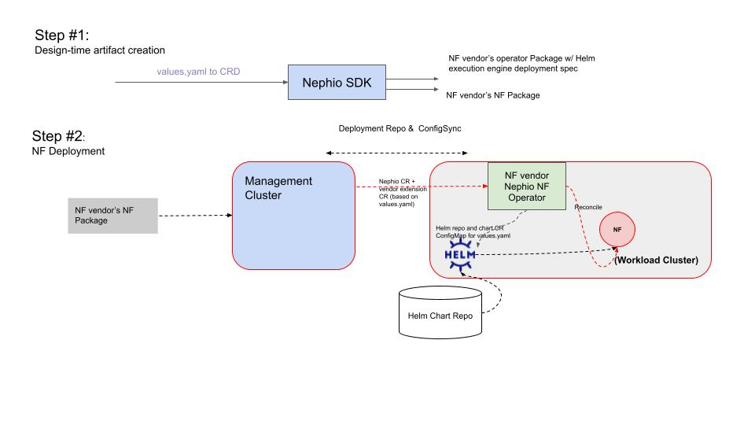
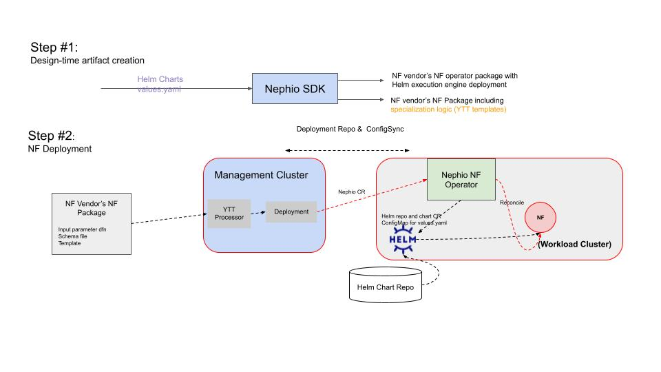

# nephio-sdk-poc
PoC for Nephio SDK (until code commits to nephio-project/nephio-sdk)
- Author: @s3wong
- Status: Work-in-Progress
- Approver:

## Vision (R3 development cycle discussions)
The initial focus on Nephio SDK is to enable NF vendor onboarding to Nephio. As the majority of NF vendor utilizes Helm charts for deployment of their workload, it is imperative to enable NF vendor onboarding via Helm charts. Helm onboarding as the core emphasis for the first version of Nephio SDK, as indicated by this [doc](https://docs.google.com/presentation/d/1sINV9lyekKGSjJ12OzjalQkuwJ0KNuiXWNo5ulZ_c1U/edit#slide=id.p).

Consensus:
1. Helm as first class citizen
2. git repo to access Helm charts
3. Helm chart execution engine (ex: helm client, helm operator, Flux' helm controller) a choice of NF vendors

### Workflow
The following diagram depicts the preliminary Nephio SDK workflow:

1. User would invoke *nephio-sdk* CLI which would create two packages
    1. operator package including the NF specific operator for Nephio CRD, and any other dependent software for the workload
    2. workload package (i.e., NF package) including CR for Nephio CRD, and CR for values.yaml related CRD
2. The first package should be loaded first, which would result in deployment of Nephio CRD operator and all the dependent software for the target workload
3. The second package is then used for workload deployment on workload cluster

User would first deploy the operator package to workload cluster to ensure all the deployment related dependencies are deployed. Then during deployment time, user would clone the workload package, apply specialization (NF instance specific values for values.yaml), and deploy the package to target workload cluster.

#### Helm Onboarding: values.yaml generation
The original idea (during the R2 and R3 development cycles) was that the Nephio SDK CLI would be a wrapper of either kubebuilder or operator-sdk, i.e., the Nephio SDK workflow would also include the CRD definition and operator development phases. In this case, the Nephio SDK CLI would be wrapping kubebuilder, and would generate CRs from the defined CRDs, and include those into the workload package. Given that values.yaml is translated into CRDs, user has the freedom to either resolve
some of all  of the input values during the hydration pipeline, or the remaining ones at the NF operator (on workload cluster) as the operator would apply the fully resolved values.yaml (CRD or ConfigMap) and deliver that to the Helm execution engine.

With the advent of utilizing tools such as [YTT](https://github.com/nephio-experimental/ytt-declarative-configuration/tree/main), template and scheme can now be part of the NF workload package, and user can now provide the input values directly as a CIQ (customer input query) during the hydration pipeline. This is currently done entirely manually --- but it can also be provided by a controller in the future.

#### Nephio controller runtime
As part of the Nephio SDK, a "proxy operator" is also provided. The idea is that Nephio CRD version and a proxy operator implementation is 1:1. That is, user (NF vendor or SI in this case) can match the supported CRD version with the operator package with the proper proxy. The proxy operator can initially be simply an operator with stubs where user can implement how to reconcile Nephio CR specifically for their workload.

A sample implementation of the Nephio proxy operator can be found [here](https://github.com/s3wong/nephio-code/tree/main/nfdeployment). This implements a gRPC client and a stub gRPC server where the user should only need to implement a set of stub functions at the gRPC server side. The original idea was to implement these in different programming languages. However, given that during Nephio launch to R3, we have witnessed NF vendor community getting more and more comfortable
implementing K8s operator with golang. This likely is no longer needed. What it can serve is as a sample where it constructs and applies free5gc values.yaml ConfigMap with Flux Helm controller as the helm execution engine.

#### Helm execution engine
As mentioned above, the Helm execution engine is a choice of the workload (NF) vendor, and the deployment specification of this execution engine should be included as part of the workload package, and should be added as part of the package generation step of Nephio SDK workflow.

For R3, the example under development was [Flux' Helm controller](https://fluxcd.io/flux/components/helm/). A step by step (manual) guide on deploying the entire group of free5gc NFs is provided [here](https://github.com/nephio-project/nephio/issues/504), and the [code](https://github.com/s3wong/nephio-code/blob/main/nfdeployment/nfdeployment-operator/internal/controller/templates.go#L25) for the ConfigMap template. This part of the work --- delivering values.yaml to the helm
execution engine --- is implemented in the NF operator. In the case of YTT, values.yaml is already fully resolved and represented as a ConfigMap which is applied to workload cluster's Kubernetes API server via configsync.

